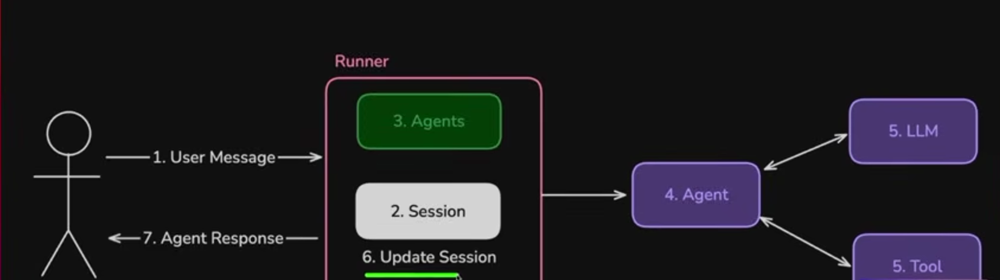

# Session

Session consists of two major pieces of information:
1. State: Here you can store all sort of information in a dictionary
2. Events: Message history between us and the agent

Session also have additional info:
- id
- app_name
- user_id
- last_update_time

## Types of Session:
1. InMemorySessionService: Saving each conversation in memory. As soon as we close application, everything is gone.
2. DatabaseSessionService: Saving each conversation in database.
3. VertexAISessionService: Saving in Google Cloud AI platform

## Runner
A collection of two things, Agents and Session

